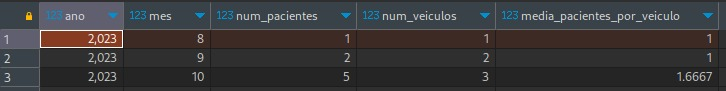

Resultados após execução:

parte do codigo usada para fazer a media de pessoas por mes: 

  SELECT  
  YEAR(dia) AS ano, 
  MONTH(dia) AS mes, 
  COUNT(*) AS num_pacientes, 
  COUNT(DISTINCT id_veiculo) as num_veiculos, 
  COUNT(*) / COUNT(DISTINCT id_veiculo) AS media_pacientes_por_veiculo 
  FROM  
  logistica.trans_pacientes 
  GROUP BY 
  ano, mes; 

  resultado: 
  

Diagrama: 

 
Acesso ao banco de dados: 

hostname: http://dbponderada.cc0qa9him3hl.us-east-1.rds.amazonaws.com 
nome de usuario: admin 
senha para acesso: 12345678
